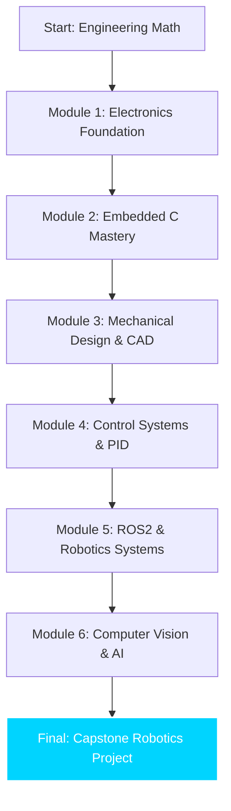

# 🎓 Elite Mechatronics Curriculum

**A Comprehensive, Industry-Aligned Roadmap for Robotics & Control Engineering Excellence**

*Don't just study engineering. Master it.*

[Why This Curriculum?](#-why-this-curriculum) • [Overview](#-curriculum-overview) • [Learning Path](#-learning-path) • [Resources](#-curriculum-resources) • [Contributing](#-contributing)

---

## 🎯 Why This Curriculum?

Traditional engineering degrees often focus too much on theory and not enough on the **physical reality of building robots.** 

**`elite-curriculum`** is a curated, project-first learning roadmap designed to transform a student into a world-class Mechatronics Engineer. Every module is paired with a **physical hardware prototype requirement**, ensuring that theory is immediately validated by reality.

- 🛠️ **Project-Centric**: Every theoretical concept is mapped to a hardware module.
- 🏗️ **Full-Stack Mastery**: Covers Mechanical Design, Electronics, Control Theory, and AI.
- 🚀 **Industry Aligned**: Focuses on tools used by top R&D firms (ROS2, STM32, SolidWorks, Altium).

---

## 📚 Curriculum Overview

| Module | Core Subjects | Hardware Milestone |
|:---|:---|:---|
| 📐 **Phase 1: Fundamentals** | Physics, Calculus, Statics | Mechanical Mechanism Prototype |
| ⚡ **Phase 2: Electronics** | Circuit Analysis, Semi-conductors | Regulated Variable Power Supply |
| 💻 **Phase 3: Embedded** | C/C++, Microcontrollers, RTOS | Multi-Sensor Data Logger (STM32) |
| ⚙️ **Phase 4: Mechanics** | Dynamics, CAD/CAM, GD&T | 3-DOF Robot Arm Design (SolidWorks) |
| 🤖 **Phase 5: Robotics** | Kinematics, ROS2, Control | Autonomous Mobile Robot (Differential Drive) |
| 🧠 **Phase 6: AI & Vision** | OpenCV, CNNs, Reinforcement Learning | AI-Powered Sorting Manipulator |

---

## 🛤️ Learning Path

---

## 📂 Curriculum Resources

- 📑 **Lecture Notes**: Structured summaries of core engineering concepts.
- 📁 **Lab Worksheets**: Step-by-step guides for building the hardware milestones.
- 💾 **Starter Code**: Boilerplate code for STM32, Arduino, and ROS2 modules.
- 📐 **CAD Templates**: Base assemblies for common robotic platforms.

---

## 🤝 Contributing

This curriculum is a living document. We welcome contributions from educators and industry professionals!

- Propose a new module via **Issues**.
- Fix typos or improve explanations via **Pull Requests**.
- Share your hardware build photos to inspire others!

---

## 📄 License
Distributed under the MIT License. See `LICENSE` for more information.

## 👤 Author
Curated by **Engineer Abdullah Bin Zafar**.
*Dedicated to the next generation of robotics innovators.*

